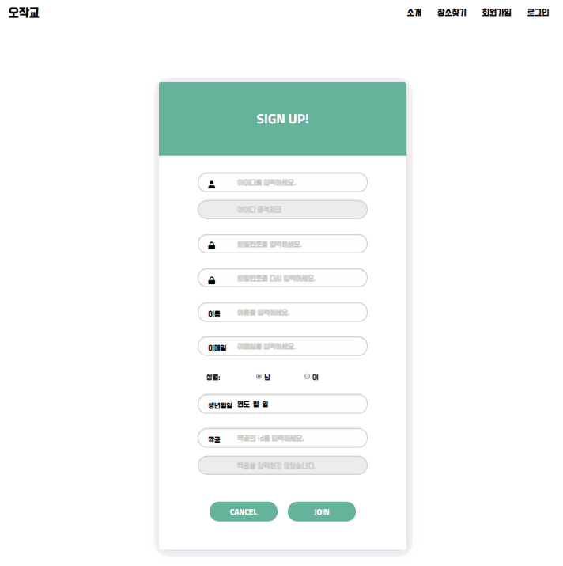
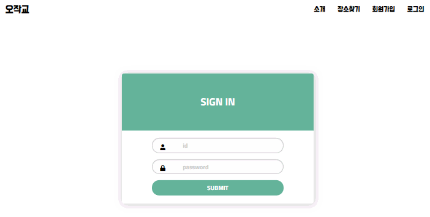
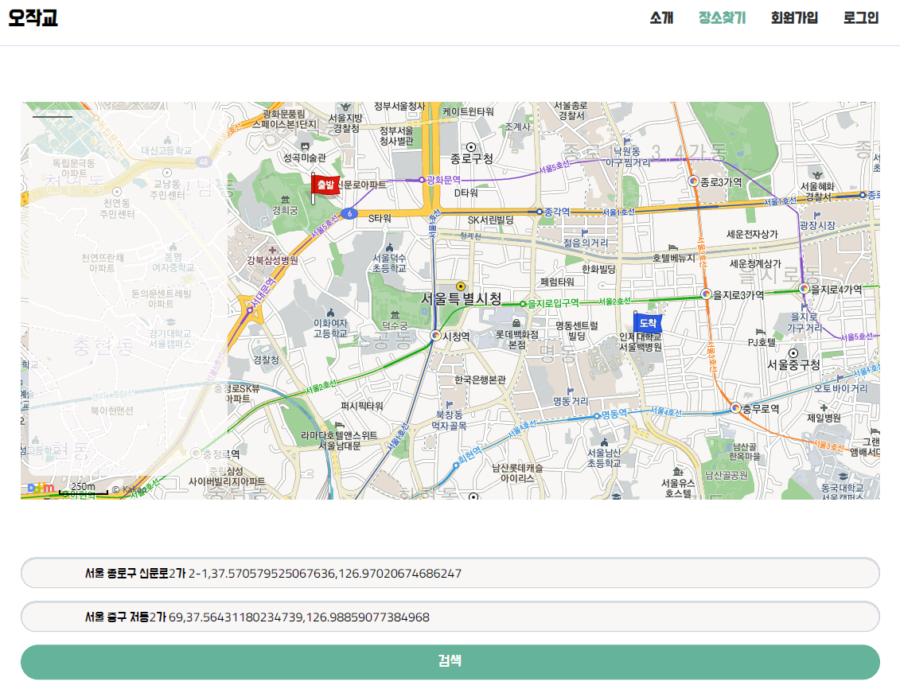

# 서비스 소개
```
오작교 서비스는....

'오'늘의 '작'은 '교'감을 이루어주는 까마귀와 까치의 역할을 합니다.

칠석날 견우와 직녀의 두 별을 만나게 하기 위하여
까마귀와 까치가 만드는 다리를 의미하는 오작교에 대해 들어보셨나요?

첫인상을 좌우하는 첫 데이트 장소 또는
사랑하는 사람과의 특별한 추억을 '저장~'해줄 그 곳을 검색해보세요!

# 프로젝트 개요
- 사용자에게 합리적인 약속장소를 정할 수 있도록 도움을 주며 약속장소 주변의 맛집 정보를 찾아 제공하는 웹 서비스
```

## 시연 화면







## 사용된 기술
- HTML, CSS, JS
- MVC 모델 기반의 JSP
- 다음 Map api
- jsoup Web clawring

## 실행
    - WebContent/service/daumMap.jsp  -> 94 line api key값 입력
    ```
    <script type="text/javascript"
	    src="//dapi.kakao.com/v2/maps/sdk.js?appkey=<api key값 입력>&libraries=services"></script>
    <script>
    ```

## 프로젝트 파일 구조

```

├─src
│  └─com
│      └─encore
│          ├─filter
│          │      EncodingFilter.java
│          │
│          ├─frontPattern
│          │      AddressInsertController.java
│          │      CommonCtroller.java
│          │      FrontController.java
│          │      GetPathInfoController.java
│          │      IdCheckController.java
│          │      LoginController.java
│          │      setMyAddController.java
│          │      UserDeleteController.java
│          │      UserInsertController.java
│          │      UserUpdateController.java
│          │
│          ├─jsonparser
│          ├─MarketStoreList
│          │      AddressToLocation.java
│          │      DistanceMeasurment.java
│          │      LocationToAddress.java
│          │      Menulist.java
│          │      StoreDetails.java
│          │      StoreInfoDTO.java
│          │      StoreList.java
│          ├─model
│          │      AddressVO.java
│          │      UserDAO.java
│          │      UserService.java
│          │      UserVO.java
│          ├─place
│          │      BusPlace.java
│          │      Movement.java
│          │      RouteSummaries.java
│          │      SubwayPlace.java
│          │      Summaries.java
│          │      Walking.java
│          ├─service
│          │      ChromeDriverUtil.java
│          │      FrontController.java
│          └─util
│                  Conversion_location.java
│                  DataUtil.java
│                  DateUtil.java
│                  MapToJson.java
│                  OracleDBUtil.java
├─target
├─WebContent
│  │  chromedriver.exe
│  │  file.jsp
│  │  gulpfile.js
│  │  index.jsp
│  │  LICENSE
│  │  nav.jsp
│  │  package-lock.json
│  │  package.json
│  │  README.md
│  ├─asset
│  │  ├─font-awesome
│  ├─META-INF
│  ├─service
│  │  │  congnamul.js
│  │  │  daumMap.jsp
│  │  │  geolocation.html
│  │  └─css
│  ├─user
│  │      addlist.jsp
│  │      addressInsert.jsp
│  │      sign.jsp
│  │      signUp.jsp
│  │      userDelete.jsp
│  │      userDetail.jsp
│  │      userResult.jsp
│  └─WEB-INF
└─WebServiceUML

```
